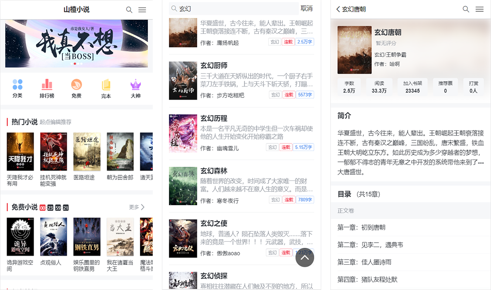
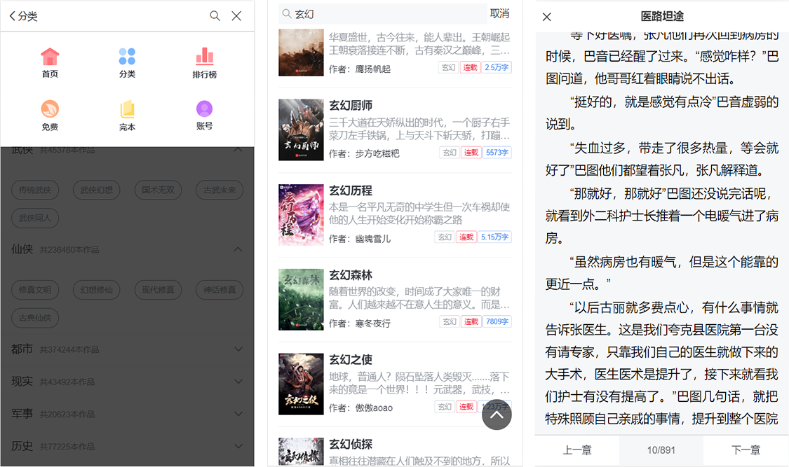

# vue-fiction

## 在线预览
**由于目前只支持指定账号登录(没有使用数据库)，所以没有更新到服务器，需自己clone下来运行看效果。（本人对后端业务了解比较少，可能存在问题。后期会努力提升）**
> 项目演示地址：[仿小说网WebApp](https://fiction.tmfree.xyz)。(纯属个人练手，巩固知识，无其他用途)

> 项目源码地址：[vue-ts-fiction](https://github.com/Tmfree/vue-fiction)。觉得还可以的话给个star 在这先谢谢了~

## Build Setup

### 客户端
``` bash
# 下载或克隆下来，然后安装依赖
yarn or npm install

# 开发预览
yarn or npm serve

# 打包发布，生成的文件在dist文件夹中
yarn or npm build
```

### 服务端
``` bash
# 提取server文件夹,安装依赖
yarn or npm install

# 运行
node app.js
```
## 接口请求的变量修改

### 开发环境
```bash
# .env.development文件
VUE_APP_BASEURL="url"
```
### 生产环境
```bash
# .env.production文件
VUE_APP_BASEURL="url"
```
## 更新
添加登录模块、点赞和收藏，目前只支持现有账号的登录，后期添加注册模块
```
账号：123456
密码：123456
```

## 项目结构
```
|-- fiction
    |-- .env.development 开发环境变量
    |-- .env.production 生成环境变量
    |-- .gitignore
    |-- babel.config.js
    |-- package.json
    |-- postcss.config.js
    |-- README.md
    |-- vue.config.js
    |-- yarn.lock
    |-- public
    |   |-- favicon.ico
    |   |-- index.html
    |-- server   服务器端接口Api
    |-- src
        |-- App.vue
        |-- main.js
        |-- assets
        |-- components
        |-- request 请求设置
        |-- router  路由
        |-- store
        |   |-- getter.js
        |   |-- index.js
        |   |-- module
        |       |-- common
        |       |-- rank
        |-- utils
        |   |-- navBar.js 
        |   |-- vw.css
        |-- views
            |-- About.vue
            |-- BookInfo.vue
            |-- CatDetail.vue
            |-- Category.vue
            |-- Home.vue
            |-- Layout.vue
            |-- Rank.vue
            |-- RankDetail.vue
            |-- Search.vue
```
## 预览





## 最后
要是感兴趣的话，可以自行看代码，大部分内容还是比较简单的，有问题的话欢迎提出了一起讨论

[1]: https://github.com/Tmfree/vue-fiction
[2]: https://fiction.tmfree.xyz/
