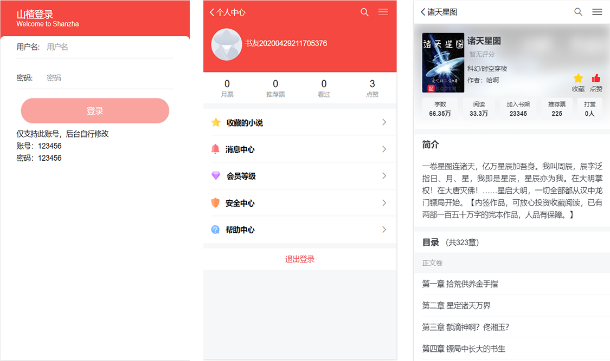

# Vue-TS-Fiction
基于 Vue(2.6)+ Typescript + Vuex +Vue-Router + Axios + Vant UI + Scss + ES6 等开发一款小说 WebApp，UI 界面参考了移动版的起点中文网、flex 布局适配常见移动端。

## 前言
项目前端基于vue-cli升级为ts版，后台数据通过node简单爬取，所以对于数据格式定义也比较宽松。因此，前端使用ts定义数据类型比较鸡肋。目前大多数据使用any类型定义。后期会重新规划数据格式，在细化定义。

~~ ts初学者，请多多吐槽！！！

## 在线预览
**目前只支持指定账号登录(没有使用数据库)，所以没有更新到服务器，需自己clone下来运行看效果。（本人对后端业务了解比较少，可能存在问题。后期会努力提升）**
> 项目演示地址：[仿小说网WebApp](https://tmfree.dowy.cn)。(纯属个人练手，巩固知识，无其他用途)

> 项目源码地址：[vue-ts-fiction](https://github.com/Tmfree/vue-fiction)。觉得还可以的话给个star 在这先谢谢了~

## 接口请求的地址

### 开发环境
```bash
# .env.development文件
VUE_APP_BASEURL="url"
```
### 生产环境
```bash
# .env.production文件
VUE_APP_BASEURL="url"
```
## 更新
添加登录模块、点赞和收藏，目前只支持现有账号的登录，后期添加注册模块
```
账号：123456
密码：123456
```


## 项目部分结构
```
|-- fiction
    |-- .env.development 开发环境变量
    |-- .env.production 生成环境变量
    |-- .gitignore
    |-- babel.config.js
    |-- tsconfig.json
    |-- package.json
    |-- postcss.config.js
    |-- README.md
    |-- vue.config.js
    |-- yarn.lock
    |-- src
        |-- interface //接口存放
            |-- base.ts
            |-- user.ts
        |-- App.vue
        |-- main.ts
        |-- assets
        |-- components
        |-- request 请求设置
        |-- router  路由
        |-- store
        |   |-- getter.ts
        |   |-- index.ts
        |   |-- module
        |       |-- common
        |       |-- rank
        |-- utils
        |   |-- navBar.ts
        |   |-- vw.css
```
## 预览


## 最后
要是感兴趣的话，可以自行看代码，大部分内容还是比较简单的，有问题的话欢迎提出了一起讨论

[1]: https://github.com/Tmfree/vue-fiction
[2]: https://tmfree.dowy.cn/

## Build Setup

### 客户端
``` bash
# 下载或克隆下来，然后安装依赖
yarn or npm install

# 开发预览
yarn or npm serve

# 打包发布，生成的文件在dist文件夹中
yarn or npm build
```

### 服务端
``` bash
# 提取server文件夹,安装依赖
yarn or npm install

# 运行
node app.js
```
